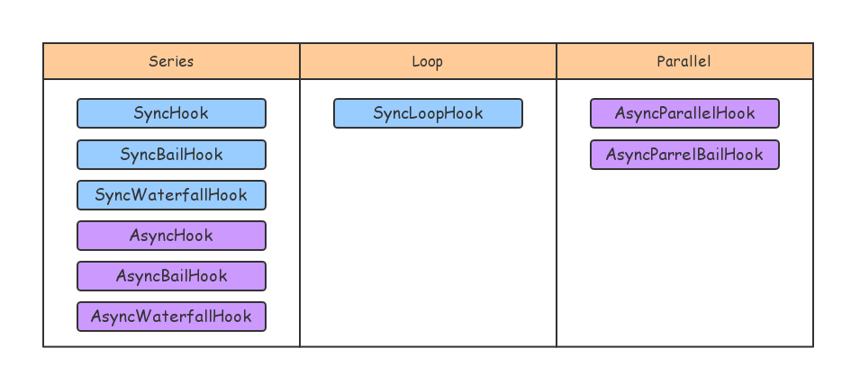

# Tapable 架构 05

撇开代码实现的好坏，Tapable 中还存在很多其他类型的钩子，大抵上与 SyncHook 差不多，只有在编译执行函数时根据钩子类型以及执行方法生成不同的结果。

根据执行方式来区分：



其中个别钩子的名称与源码中的名称不太一致，原名比较怪（`AsyncSeriesLoopHook` 等），感觉像是功能迭代后名称仍没有统一。所以这里对钩子名称进行了统一命名。

## Series

首先是 Series 类型，顺序执行。这也是之前 SyncHook 钩子的执行方式，这里就不再赘述。但是出现了 `bail` 和 `waterfall` 两个关键词，看起来像是另外一种执行方式，所以简单说一下它们都是什么。

这两者都是在顺序执行的基础上，做一些额外工作：

- `bail` 会在原来基础上对每个插件的返回值进行判断，如果存在返回值，就会直接终止执行函数，并返回该结果值。
- `waterfall` 是将上一个插件回调的返回值作为下一个插件回调的参数，看起来就像是水管一样，将输入（首个参数）不断在插件中传递，得到最终的结果。

具体的实现不用看代码也可以想出来，在 `content` 中调用 `callTapsSeries` 传递特定的 `onResult` 代码，像这样：

```js
// bail
onResult = (i, result, next) =>
  `if(${result} !== undefined) {
    ${onResult(result)};
  } else {
    ${next()}
  }`;

// waterfull
// onResult = (i, result, next) => {
//   let code = "";
//   code += `if(${result} !== undefined) {\n`;
//   code += `${this._args[0]} = ${result};\n`;
//   code += `}\n`;
//   code += next();
//   return code;
// }
// 上面是注释的源代码，下面是我使用模板字符串改过的代码，看起来方便点
onResult = (i, result, next) => `
  if(${result} !== undefined) {
    ${this._args[0]} = ${result};
  }
  ${next()}
`
```

## Loop

Loop 类型，循环顺序执行，即在顺序执行的外层套一个 `do{} while()` 循环，循环的条件则是插件的返回值，具体为如果某个插件存在返回值，则跳过剩余插件回调，再次顺序执行。

```js
function anonymous() {
	"use strict";
	var _context;
	var _x = this._x;
	var _loop;
	do {
		_loop = false;
		var _fn0 = _x[0];
		var _result0 = _fn0();
		if (_result0 !== undefined) {
			_loop = true;
		} else {
			var _fn1 = _x[1];
			var _result1 = _fn1();
			if (_result1 !== undefined) {
				_loop = true;
			} else {
				if (!_loop) {}
			}
		}
	} while (_loop);

}
```

上面的代码就是循环类型的执行函数。与上面说过的 `bail` 类似，也是在顺序执行的基础上传递不同的 `onResult` 得到的。

这种类型的执行方式的目的看起来是当某个插件调用存在问题时，就循环执行知道该插件回调得以正常调用。但似乎有个性能问题：插件之间应该是互相独立的，当某个插件出问题时，理应只再次执行当前插件回调，但这里还会将当前插件前所有插件都再运行一遍。

## Parallel

parallel 并行执行，看起来似乎很强大，但 Javascript 本身只是单线程的，虽然可以使用 `Web Wroker` 可以做到真正的并行，但这里的“并行”不是不真的并行运行，只是插件回调执行状态的判断改为异步而已，即在顺序执行的基础上，如果传入插件回调函数的回调参数或者返回 Promise 的 onFullfilled 调用且没有传递错误之后，才算作该插件执行完毕。

换句话说，这种运行方式才是我们平常说的异步运行，即顺序执行每个插件回调，等待所有的插件回调都 resolve 之后，表示钩子执行函数执行完毕，调用 `onDone`。

```js
function anonymous(_callback) {
	"use strict";
	var _context;
	var _x = this._x;
	do {
		var _counter = 2;
		var _done = () = > {
			_callback();
		};
		if (_counter <= 0) break;
		var _fn0 = _x[0];
		_fn0(_err0 = > {
			if (_err0) {
				if (_counter > 0) {
					_callback(_err0);
					_counter = 0;
				}
			} else {
				if (--_counter === 0) _done();
			}
		});
		if (_counter <= 0) break;
		var _fn1 = _x[1];
		_fn1(_err1 = > {
			if (_err1) {
				if (_counter > 0) {
					_callback(_err1);
					_counter = 0;
				}
			} else {
				if (--_counter === 0) _done();
			}
		});
	} while (false);

}
```

上面就是 `AsyncParallelHook` 并使用 `callAsync` 挂载插件编译之后的执行函数结果，从上倒下顺序执行每个插件回调，并在每个插件回调 resolve 之后判断执行函数是否执行完毕。

# 总结

本节较为粗略的介绍了 3 种不同的执行函数：

- 顺序执行；
- 循环执行；
- “并行”执行；

这里面后两者都是在顺序执行的基础上，作出一些修改得到的，因为本质上 Javascript 是单线程的，所以即便是异步，也是按照顺序执行插件回调。

另外还需要注意的是，看了执行函数的不同类型之后，你也许会对钩子、插件的同步、异步产生一定的疑惑，概括的说：

- 对于同步钩子来说，所有的插件必须是同步挂载的；
- 对于异步钩子来说，插件如果是同步挂载的，则在调用插件回调后继续调用下一个插件的回调；而如果插件是异步的，则会在插件 resolve 之后再调用下一个插件。

因此如果你要开发一个插件，首先要搞清楚钩子的类型，然后根据插件代码是同步还是异步，使用对应的挂载方式。