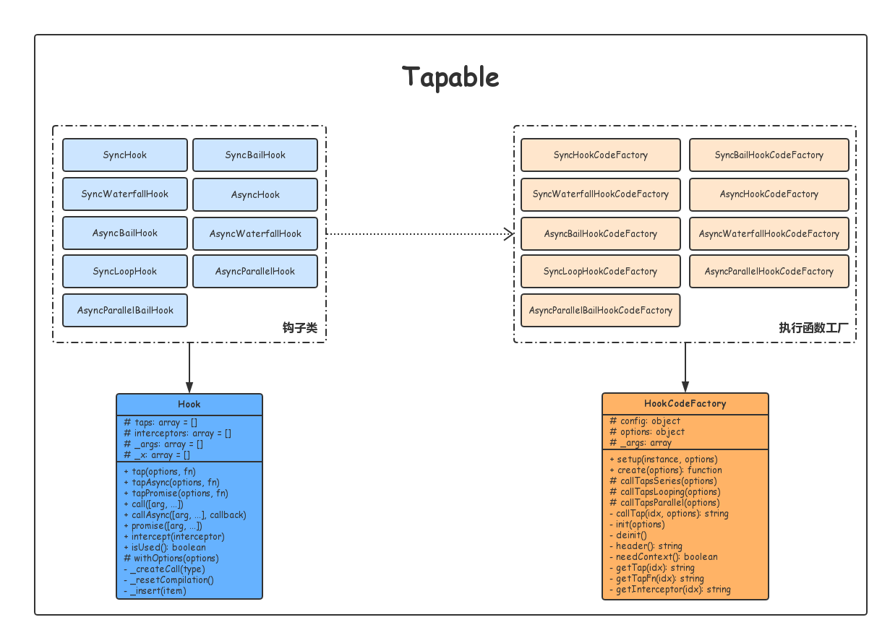
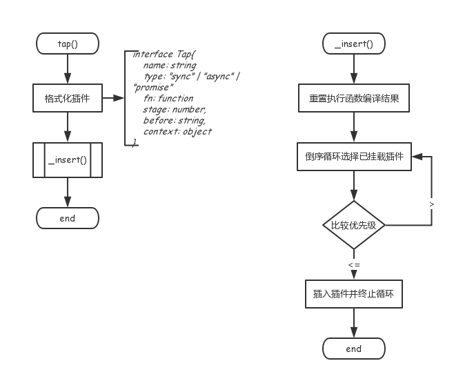
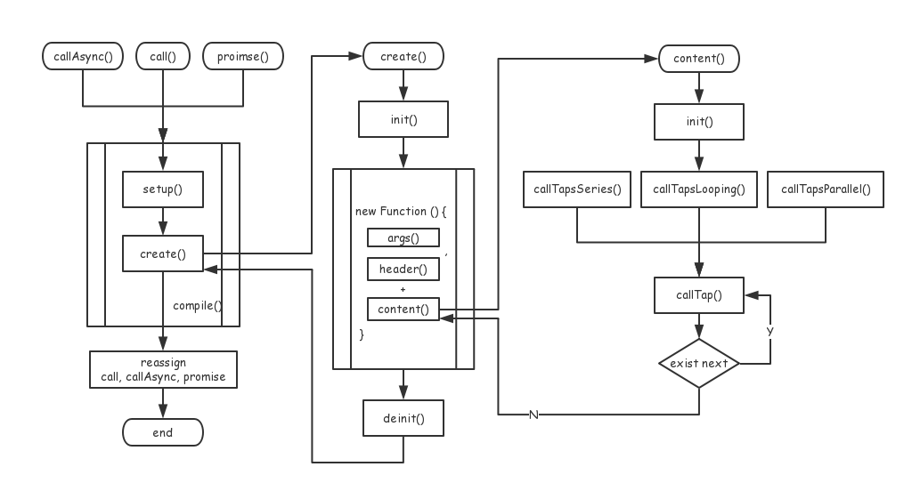

# Tapable 架构 06

至此，Tapable 基本就没什么东西了，只剩余两个用于管理多个钩子的 `HookMap` 和 `MultiHook` 的辅助类，这里就不再讲解。本节的目的在于回顾与总结。

## Tapable 结构

下面这附图描述了 Tapable 中类的关系：所有类型的钩子都是基类 `Hook` 的派生类，并依赖于对应的执行函数工厂类，所有的执行函数工厂类都派生自基类 `HookCodeFactory`。

## 钩子挂载流程

## 钩子编译过程

